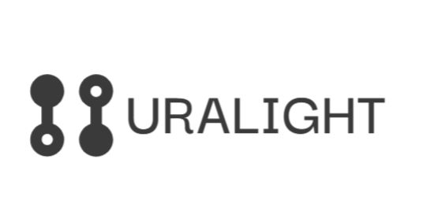

# URALight

---

## What is URALight?

URALight is a simulator for robotic manipulators, providing a physics-enabled training platform for AI models.

---

## Download

You can download the latest executable here:  
[Download URALight (.exe)](link-to-your-exe-file)
<!-- Replace 'link-to-your-exe-file' with the actual link after uploading -->

---

## Features

- Physics-based simulation for robotic manipulators
- Training environment for AI models
- Easy-to-use interface

---

## Contact

For questions or support, contact: vatsal1401@gmail.com

---

## License

Specify your license here (e.g., MIT, GPL, etc.)

---

(c) 2024 URALight
